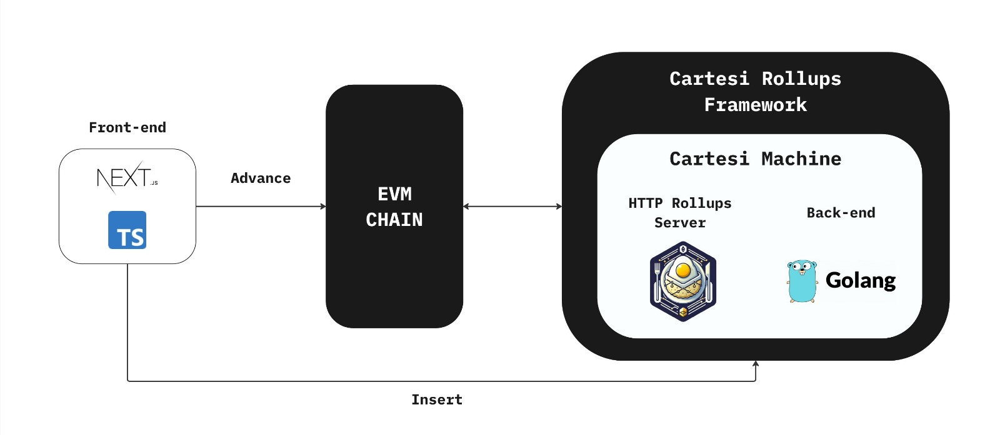

<h1 align="center">CarTracker 🚗</h1>
<p align="center"><b>Know your car</b></p>
<p align="center">
    
</p>

# The Problem 📊

In Brazil's used car market, a significant challenge is the widespread issue of transparency. Cars are often sold with tampered odometers or undisclosed modifications, leading to misrepresented values and conditions. This deception erodes consumer confidence and makes the buying and selling process unreliable and fraught with risk.

# Our Solution 💡

**CarTracker** revolutionizes the way vehicle histories are tracked by leveraging the credibility and reach of insurance companies and automakers. By accrediting car repair shops, these trusted entities ensure that every vehicle service, from maintenance to major repairs, is thoroughly documented.

## How It Works

1. **Accreditation**: Insurance companies and automakers elect trusted agents, such as reliable garages and service shops.
2. **Documentation**: Accredited shops meticulously record all service details, including odometer readings and alterations. This documentation is then uploaded to our decentralized system.
3. **Transparency and Trust**: Every record includes details about the service performed and the accrediting entity, creating a chain of accountability. If a vehicle's condition does not match its documented history, it raises a verifiable red flag for potential buyers.

## Advantages of CarTracker

-   **Decentralized System**: Our platform operates on a decentralized model, ensuring that the data is transparent and free from manipulative practices.
-   **Comprehensive Information**: Consumers gain access to a complete history of the vehicle, including maintenance, repairs, crashes, and ownership transfers.
-   **AI-Enhanced Valuations**: CarTracker uses AI to estimate the market price of vehicles based on their documented histories, helping buyers make informed decisions based on robust data.
-   **Elimination of Hidden Fees and Interests**: The platform operates with a clear, straightforward model with no hidden fees or obscured agendas.

By aligning the interests of automakers, insurance companies, and consumers, **CarTracker** addresses a critical pain point in the automotive industry. Our solution restores confidence in the used car market, enabling both buyers and sellers to engage in transactions that are fair, transparent, and based on factual data.

## Architecture :wrench:

<p align="center">
    
</p>

-   Infrastructure

    -   AWS

-   Frontend

    -   Next.js
    -   Typescript
    -   Cartesi

-   Backend

    -   Go
    -   Rollmelette (a framework for Go within the Cartesi infrastructure)
    -   PostgreSQL

-   Blockchain
    -   Cartesi(Execution Layer)
    -   Ethers.js
    -   IPFS

## File tree

### Frontend

```
frontend
├── ABIs
├── app
├── assets
├── cartesi-client
├── components
├── lib
└── public
```

### Rollup

```
rollup
├── build
├── cmd
├── internal
│ ├── AI
│ ├── db
│ ├── middleware
│ ├── router
│ ├── services
│ └── utils
```

## Running the project locally

To run the application there are some dependencies that need to be installed due to the technologies used, they are:

-   Node Js

### Run frontend

To run the frontend app it is necessary to enter the frontend repository named `frontend` and run the following commands to install the project dependencies and then to run the client.

```
  $ pnpm i
  $ pnpm dev
```

### Run rollup

```bash
$ npm i -g @cartesi/cli
```

> [!WARNING]
> Rode o seguinte comando para verificar se instalação foi reaizada com sucesso e a sua máquina está pronta, antes de seguir em frente:
>
> **_Input:_**
>
> ```bash
> $ cartesi doctor
> ```
>
> **_Output_**
>
> ```bash
> Your system is ready.
> ```

#### Build da aplicação:

```shell
$ cartesi build
$ cartesi run
```

## Our Team

<table>
  <tr>
    <td align="center">
      <a href="https://www.linkedin.com/in/gabriel-farias-alves/">
        <br>
        <sub>
          <b>Gabriel Farias Alves</b>
        </sub>
      </a>
    </td>
    <td align="center">
      <a href="https://www.linkedin.com/in/marcelofeitoza7/">
        <br>
        <sub>
          <b>Marcelo Gomes Feitoza</b>
        </sub>
      </a>
    </td>
    <td align="center"> 
      <a href="https://www.linkedin.com/in/paulo-evangelista/">
        <br>
        <sub>
          <b>Paulo Presa Evangelista</b>
        </sub>
      </a>
    </td>
    <td align="center">
      <a href="https://www.linkedin.com/in/victor-severiano-de-carvalho/">
        <br>
        <sub>
          <b>Victor Severiano de Carvalho</b>
        </sub>
      </a>
    </td>
  </tr>
</table>
